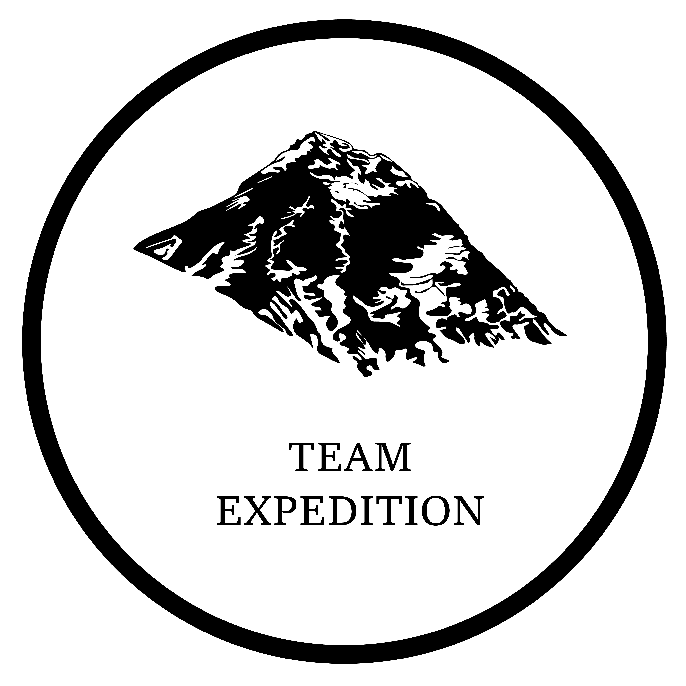
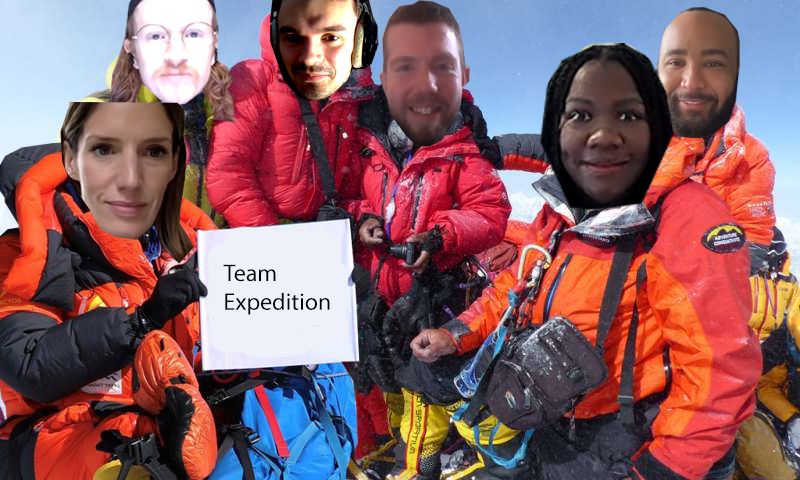

# Team Expedition

## About Project

- This was a week-long hackathon created by a team of six as part of the School of Code bootcamp.
- We were given a brief on Monday morning and had until Friday to put this together, including:
  - User research
  - Defining the problem statement
  - Designing and wireframing the UI
  - Coding the font and back end
  - Presenting the final product to other bootcampers and external stakeholders

## How it's made

- This version of the project is stored in my personal github for the purpose of deploying as an example for my portfolio
  - It's fundementally identical to the original group project but may have small changes required to deploy in a way that ties in with my overall [portfolio site](yamyamalex.netlify.app) (this is still in development)
  - I have made this diverged copy in order to have control over the deployment, not to claim the project as my own!
- The general structure follows an MVC (models, routes, controllers) format.
  - The icebreaker page calls a random response from the internal database (db)
  - The topic conversations calls an external database - this is to allow for future development where topic suggestions can be pushed to the database by users

## My Involement

- As this was a team project I would just like to highlight some areas I took a particular focus on during development:
  - MVC structure: I personally really like this structure as it mades the codebase very clear and easy to follow. A personal principle of mine is making it easy for yourself or someone else to come back to later and I pushed for the implementation of this structure from the early stages of development and took point in setting out our file structre for this reason.
  - Back End: I spent the biggest portion of the week working on the icebreaker page (as part of a sub-group of the team), creating the json file, the route handler and the controller to call the database and return a random result.

## Meet the Team

Alexander Brown, Hannah Thorley, Liz Robson, Joe O’Donovan, Rikiah Williams and Cal Woodford
 
 
 

 
 

